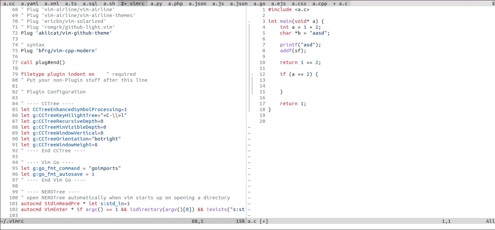

# Vim Github Theme

Github color theme for vim.

## Support themes:

- [x] Light default
- [x] Light high contrast
- [ ] Light Protanopia & Deuteranopia
- [ ] Light Tritanopia
- [ ] Dark default
- [ ] Dark high contrast
- [ ] Dark Protanopia & Deuteranopia
- [ ] Dark Tritanopia
- [ ] Dark dimmed

## Screenshots

Only support light theme.



## Install

Vim-Plug

```vim
Plug 'akiicat/vim-github-theme'
```

## Usage

Put it in your vimrc

```vim
colorscheme github_light
```

